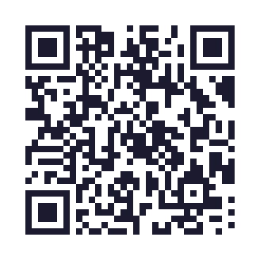
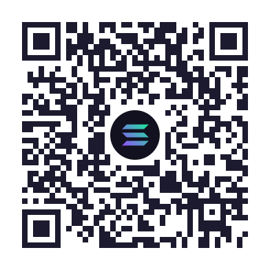
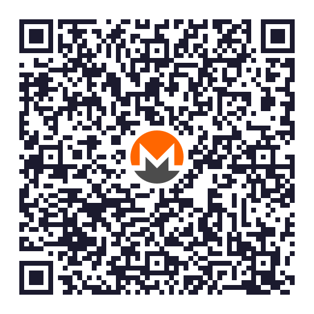
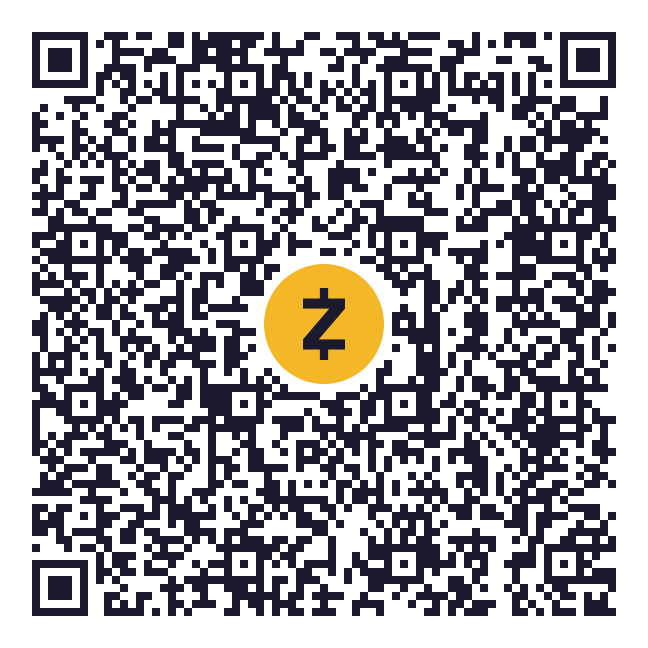

In a world that hums a tune I cannot echo, I am a silent cat slipping through unseen alleys. My fur bears muted tales, each mark a shadowed whisper. Cast adrift from familiar confines, I wander the night, meeting fleeting reflections in fellow strays, seeking an end.

<p align="center">
<a href="https://github-readme-stats-one-bice.vercel.app/api?username=eztakesin&show_icons=true&include_all_commits=true&role=OWNER,ORGANIZATION_MEMBER&bg_color=5bcefa&title_color=ffffff&text_color=ffffff&icon_color=ffffff&ring_color=ffffff&hide_border=true&border_radius=14" target="_blank">
  
</a>
<a href="https://github-readme-stats-one-bice.vercel.app/api/top-langs/?username=eztakesin&layout=compact&langs_count=8&include_all_commits=true&role=OWNER,ORGANIZATION_MEMBER&bg_color=5bcefa&title_color=ffffff&text_color=ffffff&hide_border=true&border_radius=14">
  
</a>
</p>

<details>
<summary><small>Give me some food if you like my projects</small></summary>

<br>

- Your stars and follows are the biggest support to me.
- Cryptocurrency: scan a code with your wallet, or copy the address from the box next to it. After pasting, compare the first and last six characters. The same addresses are listed at <https://play.ssf.network/donate>.

<!-- donate:start (written by scripts/gen-donate.mjs of the website's sources: change an address there, never here) -->



 **Bitcoin**<br><sub>BTC, on the Bitcoin network</sub>

A Taproot address (it starts with bc1p). A few older wallets and exchanges cannot send to Taproot addresses yet.

```text
bc1pmuuq249apm4zs83kmgj2f444xjzdzu6amlc8j056h4mvx9l7wekqy2wgv6
```

<br clear="left">


 **Ethereum and EVM networks**<br><sub>ETH, stablecoins and other tokens on Ethereum, Base, Arbitrum, Optimism, Polygon, BNB Chain and other EVM networks</sub>

The same address on every EVM-compatible network: use whichever has the lowest fee for you.

```text
0x2f46f5b575c4ae379b58d4471b37d2ed55397f6d
```

<br clear="left">



 **Solana**<br><sub>SOL and SPL tokens such as USDC, on Solana</sub>

No memo or tag is needed. Capital and small letters are different characters in a Solana address, so copy it rather than typing it.

```text
2pZjiHjADu2P9qwxc58pkvRWngGqBn7vE3d9gncu34XJ
```

<br clear="left">



 **Monero**<br><sub>XMR, on the Monero network</sub>

A subaddress (it starts with 8). No payment ID is needed.

```text
85pC3mUAFWnTjYzkEWLS3VQBZdq7FEKSbbLmeiouBnsr5PKqhuenfXPBsMYt8C6da4DnrTJ3RdjksC44zZRE6YpvJaq5fcn
```

<br clear="left">



 **Zcash**<br><sub>ZEC, shielded, on the Zcash network</sub>

A unified address (it starts with u1) with shielded receivers only, and no transparent one. Send from a wallet that supports unified addresses; an exchange that can only withdraw to transparent t-addresses cannot send here.

```text
u146gwwuvfh97ufw4l329ry5ld0amxy740xjgj90wkx3qjkwc2yd6dysm6khfmk5m4mlrhkz65kmqnwxw74lytukpuqp4ymvtevsrf5fnt6uwlw4wjuvaj2saux70pjhzjhxz88z23940qgpgvzpuf0qxnehcv30y8pzu522laevjywy28
```

<br clear="left">

<!-- donate:end -->

</details>

<p align="center"></p>
